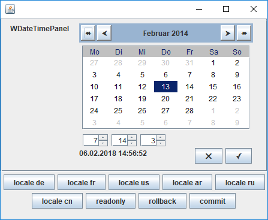

wfhcommon-gui
====

[](https://maven-badges.herokuapp.com/maven-central/se.wfh.libs.common/gui)

Some java helper classes (gui parts) I needed for several projects.

Usage: (in pom.xml)
```xml
	<dependency>
		<groupId>se.wfh.libs.common</groupId>
		<artifactId>gui</artifactId>
		<version>0.17</version>
	</dependency>
```


Gui-Widgets:
----
Inside the package se.wfh.libs.common.gui.widgets, there are several custom
Swing components with extended functions. For example:
- The date, time and datetime input field come with a popup calendar
- All components can notify a Listener about changes, which can then veto against
- Generic getValue() and setValue() methods are available, so fetching and
  setting the value of the elements does not depend on the widget type
- Simple (and somewhat complex) forms can be generated (using annotations and models, see JUnit Demo2
  for an example with all widgets)
- All widgets support a simple commit / rollback / hasChanged support

List of Gui-Widgets:
----

| Name | Type | Swing component | Locale dependent? |
|------|------|-----------------|-------------------|
| WBigDecimalTextField | java.math.BigDecimal                                     | JFormattedTextField | yes | 
| WBigIntegerTextField | java.math.BigInteger                                     | JFormattedTextField | yes |
| WCheckBox            | java.lang.Boolean                                        | JCheckBox           | no  |
| WComboBox            | se.wfh.libs.common.utils.AbstractBaseEnum                | JComboBox           | no  |
| WCurrencyTextField   | java.math.BigDecimal                                     | JFormattedTextField | yes |
| WDatePanel           | java.time.LocalDate                                      | JPanel              | yes |
| WDatePicker          | java.time.LocalDate                                      | JFormattedTextField | yes |
| WDateTimePanel       | java.time.LocalDateTime                                  | JPanel              | yes |
| WDateTimePicker      | java.time.LocalDateTime                                  | JFormattedTextField | yes |
| WDoubleTextField     | java.lang.Double                                         | JFormattedTextField | yes |
| WFileChooser         | java.io.File                                             | JFileChooser        | no  |
| WLabel               | java.lang.String                                         | JLabel              | no  |
| WList                | java.lang.Object                                         | JList               | no  |
| WLongTextField       | java.lang.Long                                           | JFormattedTextField | yes |
| WPasswordTextField   | java.lang.String                                         | JPasswordField      | no  |
| WPathChooser         | java.io.Path                                             | JFileChooser        | no  |
| WRadioButton         | java.lang.Object                                         | JRadioButton        | no  |
| WRadioGroup          | java.lang.Object                                         | JRadioGroup         | no  |
| WSpinner             | java.lang.\[Integer,Double,Float\], java.math.BigDecimal | JSpinner            | yes |
| WStringTextField     | java.lang.String                                         | JTextField          | no  |
| WTextArea            | java.lang.String                                         | JTextArea           | no  |
| WTimePanel           | java.time.LocalTime                                      | JPanel              | yes |
| WTimePicker          | java.time.LocalTime                                      | JFormattedTextField | yes |

Usage:
====
As usual, the JUnit Testcases act as examples. Furthermore, several Demo
applications are bundled with the test cases, containing all gui widgets to
play with.
The best example (in my opinion) is the "Demo2" application. It shows all the gui elements and has an underlying FormModel.

Screenshots:
====



